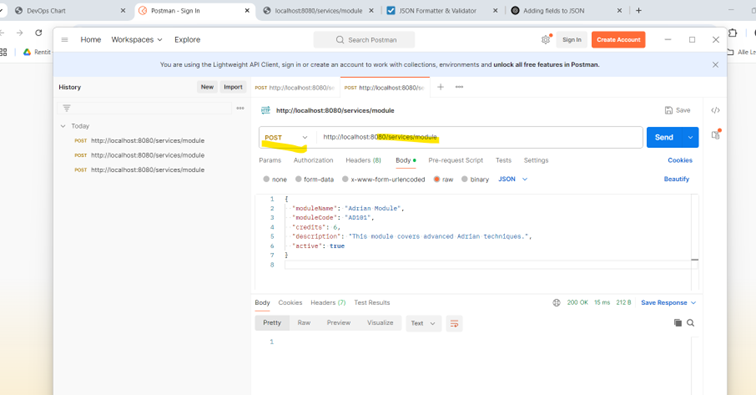
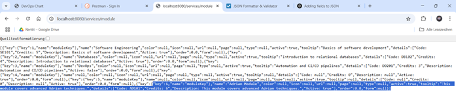

# DevOps 03 – DevOpsDemo

## 📦 Projektaufbau

Das DevOpsDemo-Projekt besteht aus zwei Komponenten:

- **Backend** (Spring Boot, Port 8080)
- **Frontend** (Path, Node.js, Port 3000)

Ich habe das Projekt von der offiziellen Vorlage kopiert und in Visual Studio Code geöffnet. Danach wurden beide Komponenten separat gestartet.

---

## 🛠 Umsetzung

### 🔧 Backend

- Verzeichnis: `/backend`
- Start: `./gradlew bootRun`
- API-Test: `http://localhost:8080/services/ping` → erfolgreich
- Erweiterung um neue REST-API: `/services/module`

### 🌐 Frontend

- Verzeichnis: `/frontend`
- Start: `npm install`, dann `npm run start`
- Test: `http://localhost:3000/` → UI wurde angezeigt

---

## 🔁 REST-API Entwicklung

Ich habe den bestehenden Service erweitert und eine neue `POST`-Anfrage zur Verwaltung von "Modulen" hinzugefügt. Die API erlaubt das Erstellen und Abrufen von Modulen mit Feldern wie `moduleName`, `moduleCode`, `description` usw.

### Beispiel-POST-Request in Postman

---

```json
{
  "modulename": "Adrian Module",
  "modulecode": "AD805",
  "credits": 6,
  "description": "This module covers advanced Adrian techniques.",
  "active": true
}
json
---

## 📸 Screenshot: POST-Request in Postman


Ergebnis in Browser (GET /services/module)
Nach dem POST ist das neue Modul per GET sichtbar:

### 📸 Screenshot: GET-Ergebnis im Browser


💡 Fehler & Erkenntnisse
Bereich	Problem	Lösung
Backend-Port	8080 war belegt	Java-Prozess beendet
Frontend-Start	Fehler bei npm run start	npm install vorher ausgeführt
JSON-Fehler	JSON im Postman war ungültig	Content-Type: application/json + Syntaxprüfung
Neue Kachel	Anpassung in model.json wurde nicht angezeigt	Frontend neu gestartet → npm run start
Pull Request	Änderung war nicht sichtbar auf GitHub	Lokale Änderungen committet & gepusht

🧑‍🎨 UI-Anpassung (Path Frontend)
Ich habe in model.json eine neue Kachel hinzugefügt:

json
Copy
Edit
{
  "type": "button",
  "name": { "default": "Module" },
  "icon": "fa-file-alt",
  "color": "wet-asphalt",
  "page": "modulePage",
  "width": 2
}
Zusätzlich wurde eine neue Seite modulePage erstellt, mit einem Button zum Anlegen eines neuen Moduls (inkl. Verlinkung zum Formular).

🧠 Learnings
Ich verstehe nun, wie Spring Boot und Node.js/Path zusammenspielen

REST-Services sind über Postman gut testbar – aber das JSON muss exakt stimmen

UI-Anpassungen im model.json wirken sich sofort aus, wenn das Frontend neu gestartet wird

Ich konnte Frontend und Backend durch eine eigene REST-Erweiterung logisch verbinden

✅ Checkliste laut Bewertungsvorgabe
 DevOpsDemo gestartet

 REST-Service GET, POST implementiert

 Test mit Postman durchgeführt

 Frontend angepasst (Kachel, neue Seite)

 Änderungen als Commits dokumentiert

 Push auf GitHub + PR erstellt
